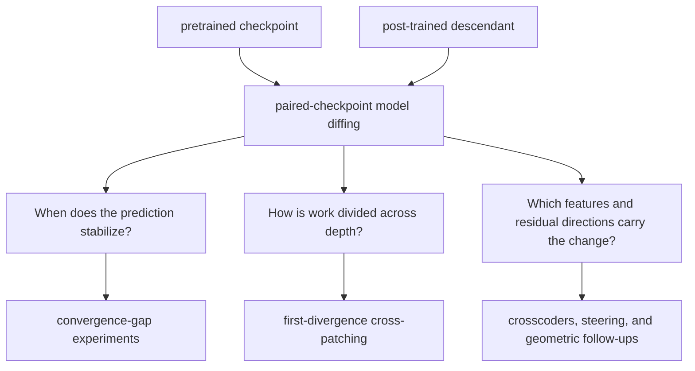

# PT-IT Model Differences

**Mechanistic model diffing for pretrained and post-trained language models**

[](https://www.python.org/)
[](https://pytorch.org/)
[](LICENSE)

This is the full research workspace behind a series of projects on how post-training changes computation inside language models. The central theme is simple: comparing final outputs tells us what changed, while model diffing can ask how the computation changed across layers.

The repository contains the broader experiment history, raw-analysis code, cloud launchers, and supporting studies. For clean paper-specific code and compact artifacts, use the two release repositories below.

## Papers

### Same Targets, Different Computation

**How Post-Training Divides Work Across Model Layers**

Two fine-tunes can learn the same target behavior while dividing the computation differently between earlier and later layers. A four-cell cross-patching diagnostic measures whether a learned late-stack effect works on the base model's earlier state or depends on earlier computation learned alongside it.

- [Paper on arXiv](https://arxiv.org/abs/2605.07284)
- [Code and compact artifacts](https://github.com/yifan1207/first-divergence-crosspatching)

Key result: with target responses, prompts, optimizer, LoRA setup, update count, and evaluation support fixed, replacing familiar instructions with newly learned nonce cues increases upstream dependence by `+5.56` logits on Qwen3-4B and `+4.18` on Llama-3.1-8B, positive in all six model-by-seed runs.

### The Convergence Gap

**Instruction-Tuned Language Models Stabilize Later in the Forward Pass**

The convergence gap measures how far each layer's decoded next-token distribution is from the model's own final distribution. Across paired checkpoints, instruction-tuned models tend to settle on their final prediction later, and late MLP windows are the strongest tested intervention point on that delay.

- [Code, paper PDF, and compact artifacts](https://github.com/yifan1207/convergence-gap-instruction-tuning)

These are separate questions. The convergence-gap paper studies prediction dynamics through depth. The cross-patching paper studies whether a learned late effect works on another checkpoint's earlier state.

## Research Map



## Start Here

| Resource | Purpose |
|---|---|
| [docs/EXPERIMENT_REGISTRY.md](docs/EXPERIMENT_REGISTRY.md) | Canonical experiment index and path conventions |
| [docs/PUBLIC_PAPERS.md](docs/PUBLIC_PAPERS.md) | Paper-to-code and paper-to-artifact map |
| [scripts/README.md](scripts/README.md) | Script layout and entrypoints |
| [REPRODUCIBILITY.md](REPRODUCIBILITY.md) | Workspace and release-level reproduction paths |
| `src/poc/cross_model/` | Shared model adapters and checkpoint registry |
| `results/paper_synthesis/` | Paper-facing summary tables and figures |

## Setup

```bash
git clone https://github.com/yifan1207/PT-IT-Model-Differences.git
cd PT-IT-Model-Differences
uv sync
uv run python scripts/infra/repo_doctor.py
```

Most full experiments require gated model access and A100/H100-class GPUs. The paper-specific release repositories provide CPU claim checkers that operate on compact committed summaries.

## Canonical Layout

```text
src/poc/exp##_descriptive_name/    experiment packages
src/poc/cross_model/               shared adapters and model registry
scripts/run/                       local and cloud launchers
scripts/analysis/                  paper and experiment analysis
scripts/plot/                      figure generation
scripts/reproduce/                 deterministic claim checks and packaging
results/exp##_descriptive_name/    compact experiment outputs
results/paper_synthesis/           paper-facing synthesis artifacts
paper_draft/                       manuscripts, appendices, and build tooling
```

The workspace contains historical experiments that are no longer part of either paper's evidence chain. The release repositories are the source of truth for public paper claims.

## Models

The shared infrastructure supports paired checkpoints from Gemma, Llama, Qwen, Mistral, OLMo, and DeepSeek families, including dense and MoE architectures. Exact checkpoint revisions and family-specific boundaries are pinned in experiment configs and paper manifests.

## Reproducibility

For a lightweight audit, clone the relevant paper release and run its checker:

```bash
# Same Targets, Different Computation
python scripts/reproduce/check_same_base_dependencies_paper.py

# The Convergence Gap
python scripts/reproduce/check_convergence_gap_claims.py
```

See [REPRODUCIBILITY.md](REPRODUCIBILITY.md) for the distinction between compact claim checks, raw-shard audits, and full multi-GPU reruns.

## License

Repository code is released under the [MIT License](LICENSE). Model checkpoints and datasets retain their original licenses; model weights are not redistributed.
